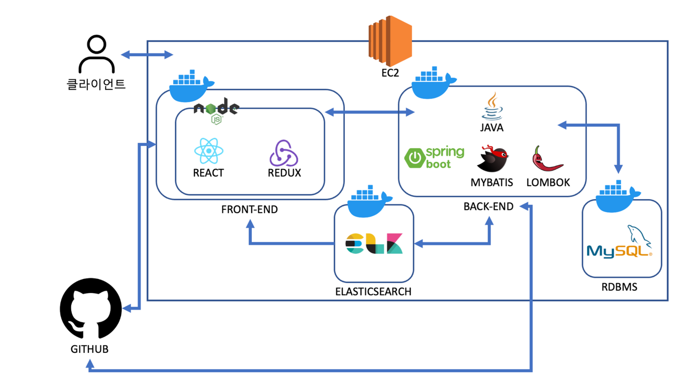

# 파이널 프로젝트 - 루트3은 4 조

## 그룹웨어 - AURORA - springboot

### 팀원
* 오승재 - os133517@gmail.com
* 서지수 - seojs3045@gmail.com
* 김수용 - ssssong125@gmail.com
* 정근호 - jgh337337@gmail.com
* 허재홍 - zero5140@gmail.com

# 🏁 main 브랜치

배포할 프로젝트를 담는 브랜치 

# 👨‍💻develop 브랜치

개발시 사용, main의 소스코드를 복제해서 main에 발생할 오류들을 예방
# 🤔feature 브랜치

devlop 브랜치에 각자 바로 커밋하지말고 만든 기능을 여기서 테스트를 해보고 잘 됬을 때 머지

feature/user, feature/board, feature/planner, feature/recode...로 작명하여 각 기능들이 무엇인지 명시

# 🔎release 브랜치

develop에 feature기능을 머지 다하면 main 브랜치에 머지 하기전에 테스트하는 브랜치 테스트 후 정상적으로 구동하면 main에다가 머지를 한다.

feature => develop => release => main 순으로 

